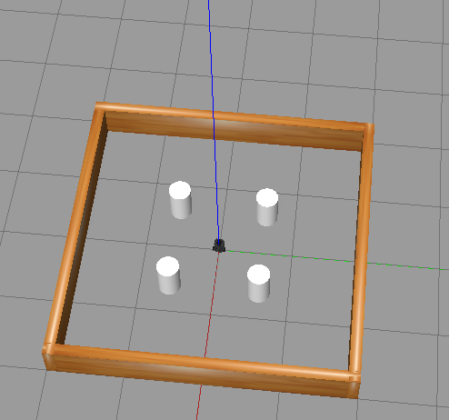
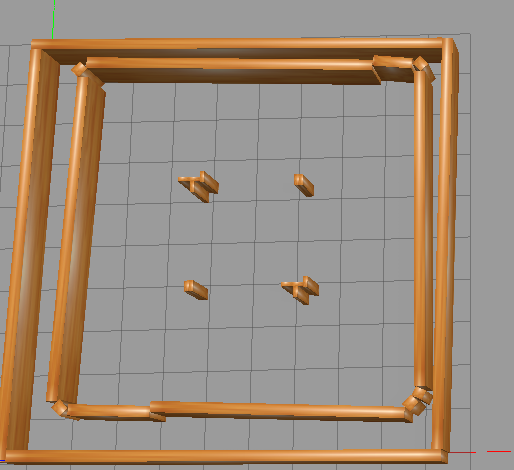
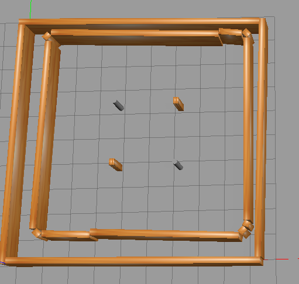
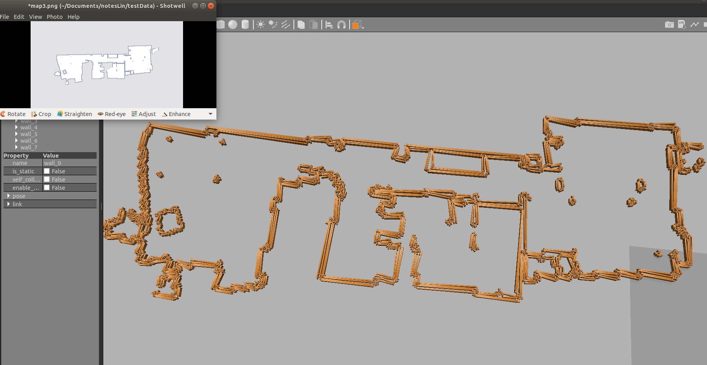
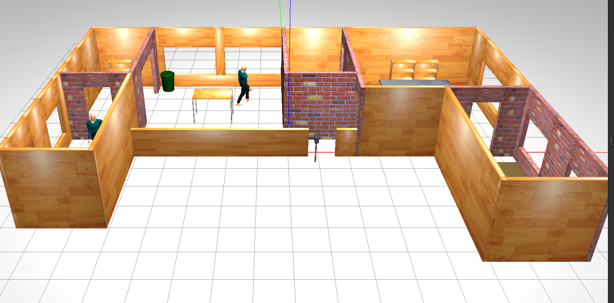
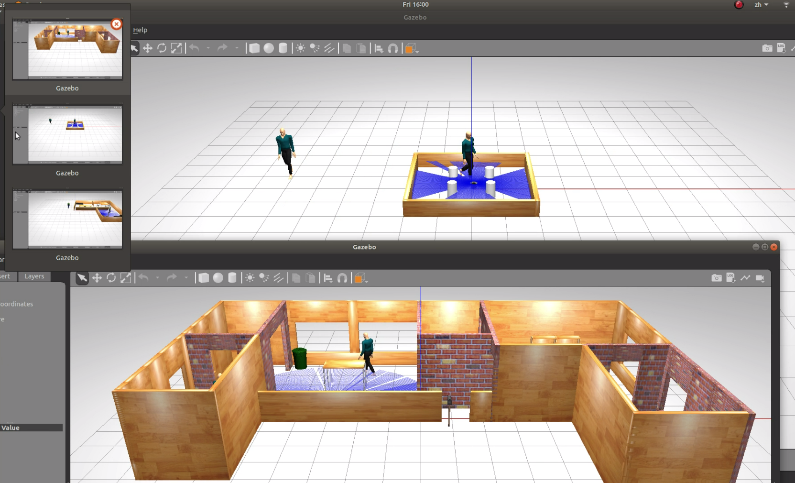

# Sim_gazebo    
## pre-requirements:
```    
apt-get install ros-melodic-move-base    
apt-get install ros-melodic-move-base-msgs   
sudo apt-get install coinor-libcoinutils-dev    
sudo apt-get install coinor-libclp-dev     
apt-get install coinor-libcbc-dev   
pip install tensorflow-gpu   
pip install gym        
```
## remove so from git 
```  
git rm --cached gym_ped_sim/actor_plugin/lib/*.so    
```    
## This is used to call the service in gazebo to build environment 
##  [video here](https://youtu.be/gpNrsE6V1mY)      
### 1 command to sapwn a world        
#### catkin folder:         
```buildoutcfg
catkin_make 
source devel/setup.bash      
roslaunch turtlebot3_gazebo turtlebot3_stage_3.launch    
```    
    
   

### 2 command to sapwn env from the map    
#### loading slam map    
```buildoutcfg     
rosrun map_server map_server RL_Ws/turtleBo_ws/map5.yaml    
```        
    
#### convert occupancyMap to sensor_msg/Image   
```buildoutcfg     
rosrun basics occmap_converter.py      
```    
      
#### using openCV to find contours    
```buildoutcfg    
 roslaunch opencv_apps convex_hull.launch threshold:=225     
```     

#### build gazebo env   
```buildoutcfg     
roslaunch gazebo_ros empty_world.launch     
rosrun basics spawn_map.py       
```      

### 3 command to spawn the map from launch file      
```   
roslaunch basics my_spawn_map.launch     
  ```
      
    
### 4 command to spawn the room from launch file   
####  sensing the polygon, and spawn the cylinder in the centroid       
```    
roslaunch basics my_spawn_room.launch     
  ``` 
  
  
### 5 command to spawn the fancy world      
```    
rosrun basics my_spawn_fancyRoom.py   
```    
   
   

### 6 command to make the actor plugins         
```    
catkin_make --pkg actor_services actor_plugin turtlebot3_social         
catkin_make --pkg actor_collisions_plugins          
```    
### 7 command to launch the world with people       
#### [tutorial how to make people detected by laser](http://answers.gazebosim.org/question/16368/can-the-actor-be-detected-by-laser-sensor/)   
```    
export TURTLEBOT3_MODEL=burger       
roslaunch turtlebot3_social mySimpleWorld.launch  gui:=true              
```    
   

### 8 command to launch several gazebo to train  
####  [tutorial launch different gazebo here](https://answers.ros.org/question/193062/how-to-run-multiple-independent-gazebo-instances-on-the-same-machine/)     
#### [vedio here](https://youtu.be/gF53edPujFk)    
```    
roslaunch turtlebot3_social myDefault.launch gui:=true    
export TURTLEBOT3_MODEL=burger       
export ROS_MASTER_URI=http://localhost:11315        
export GAZEBO_MASTER_URI=http://localhost:11356     
roslaunch turtlebot3_social mySimpleWorld.launch gui:=true     
```   

### 9 command spawn the world file and launch gazebo with the world    

```    
rosrun actor_services passing_wall_4.py       
roslaunch actor_services ped_launch_passing_4.launch       
```   

### 10 command to spawn three worlds   
#### terminal1:   
```    
export ROS_MASTER_URI=http://localhost:11315         
export GAZEBO_MASTER_URI=http://localhost:11356      
export TURTLEBOT3_MODEL=burger        
roslaunch turtlebot3_social mySimpleWorld.launch gui:=true        
```   
#### terminal2:   
```    
export ROS_MASTER_URI=http://localhost:11317         
export GAZEBO_MASTER_URI=http://localhost:11358      
export TURTLEBOT3_MODEL=burger        
roslaunch turtlebot3_social myDefault.launch gui:=true          
```  
#### terminal3:   
```    
roslaunch turtlebot3_social myFancyRoom.launch gui:=true         
rosrun basics my_spawn_fancyRoom.py            
```  
       
### 11 command to do converge path planning            
```    
rosrun iproom_exploration room_exploration_server         
roslaunch basics my_cpp.launch            
```    
### 12 command to train RL   
```
roslaunch turtlebot3_RL  turtlebot3_house_envRL.launch       
roslaunch turtlebot3_RL turtlebot3_PPO_house_v1.launch   
```   
### 13 command to run the stage_ros     
```  
export STG=/home/stage4   
export LD_LIBRARY_PATH=$LD_LIBRARY_PATH:$STG/libstage    
roscore   
rosrun stage_ros_add_pose_and_crash stageros -g path/world    
```   
### 14 command to run mpi   
```  
mpiexec --allow-run-as-root -np 24 python ppo_stage1.py    
```   